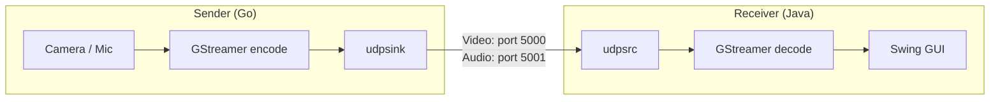

# UDP FPV Streaming

GStreamer-based low-latency video/audio streaming over UDP/RTP. Sender (Go) captures camera and microphone, encodes, and sends RTP packets. Receiver (Java/Swing) receives, decodes, and displays the stream with a GUI.

> **💡Note**
>
> This project is intended for **testing and verification purposes**:
> - Verify camera and microphone device functionality
> - Test GStreamer encoder/decoder compatibility
> - Evaluate hardware acceleration support on your platform
> - Benchmark streaming performance across different codecs and resolutions

## Architecture



## Supported Codecs

| Codec | Video Encoders (Sender)                         | Video Decoders (Receiver)                  |
|-------|------------------------------------------------|--------------------------------------------|
| H.264 | vtenc_h264_hw, amfh264enc, nvh264enc, vah264enc, openh264enc, mpph264enc | vtdec_hw, d3d12h264dec, nvh264dec, vah264dec, avdec_h264 |
| H.265 | vtenc_h265_hw, amfh265enc, nvh265enc, vah265enc, x265enc, mpph265enc    | vtdec_hw, d3d12h265dec, nvh265dec, vah265dec, avdec_h265 |
| VP8   | vp8enc, mppvp8enc                              | d3d12vp8dec, nvvp8dec, vavp8dec, vp8dec    |
| VP9   | vp9enc                                          | d3d12vp9dec, nvvp9dec, vavp9dec, vp9dec    |
| AV1   | svtav1enc, amfav1enc, nvav1enc, vaav1enc       | d3d12av1dec, nvav1dec, vaav1dec, dav1ddec  |

### 🔈Audio is fixed to Opus (48000Hz, 2ch).

## Quick Start

### 1. Build

```bash
# Sender (Go)
cd sender
go build -x -v ./...

# Receiver (Java)
cd receiver
mvn clean -Plinux package   # or -Pmacos / -Pwindows
```

### 2. Run Receiver

```bash
java --enable-native-access=ALL-UNNAMED -jar receiver/target/udp-jar-with-dependencies.jar
```

The receiver GUI opens with a menu bar to select video/audio codec and port.

### 3. Run Sender

```bash
cd sender
./udp -l                                    # List available encoders and resolutions
./udp x264enc VGA 192.168.1.10:5000         # 30fps (default)
./udp --fps 60 x264enc VGA 192.168.1.10:5000  # 60fps
```

Video is sent to port 5000, audio to port 5001 (video port + 1).

## Utility Commands

```bash
make help                # Show all available make targets
make gst-cameras         # List video capture devices
make gst-microphones     # List audio capture devices
make gst-encoders        # List available GStreamer encoders
make gst-decoders        # List available GStreamer decoders
```

## Requirements

- GStreamer 1.0 with plugins for your chosen codecs
- Sender: Go 1.25.5+
- Receiver: Java 25+, Maven

## Project Structure

```
.
├── Makefile          # GStreamer inspection utilities
├── sender/           # Go CLI sender
│   ├── main.go       # Entry point, pipeline runner
│   ├── root.go       # CLI argument parsing (cobra)
│   ├── encoder.go    # Encoder type definitions
│   ├── resolution.go # Resolution presets
│   ├── pipeline.go   # GStreamer pipeline string builder
│   ├── pipeline_builder.go  # GStreamer element-based pipeline builder
│   ├── device.go     # Interactive device selection
│   └── utils.go      # Platform detection, device property helpers
└── receiver/         # Java Swing receiver
    ├── UDPReceiver.java       # Swing GUI application
    ├── GStreamerPipeline.java  # GStreamer pipeline management
    └── pom.xml                # Maven build (jpackage support)
```
